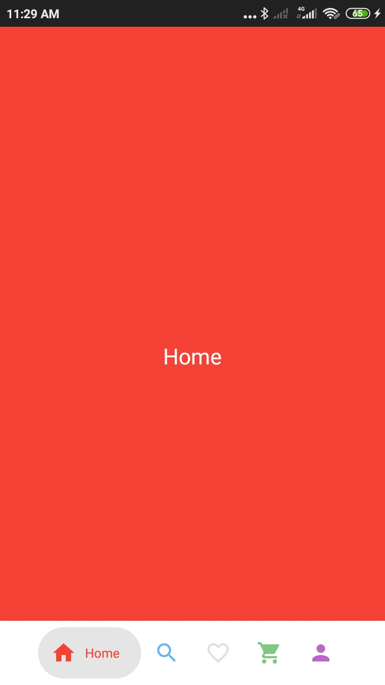
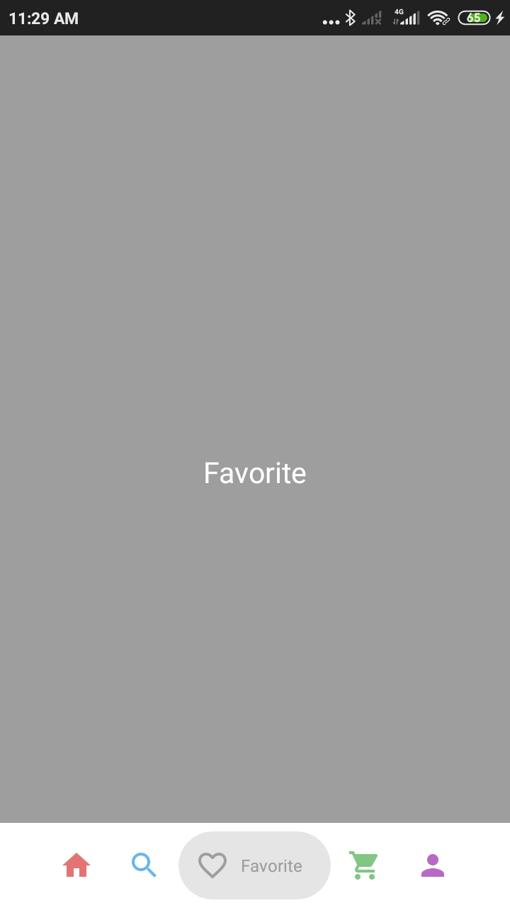
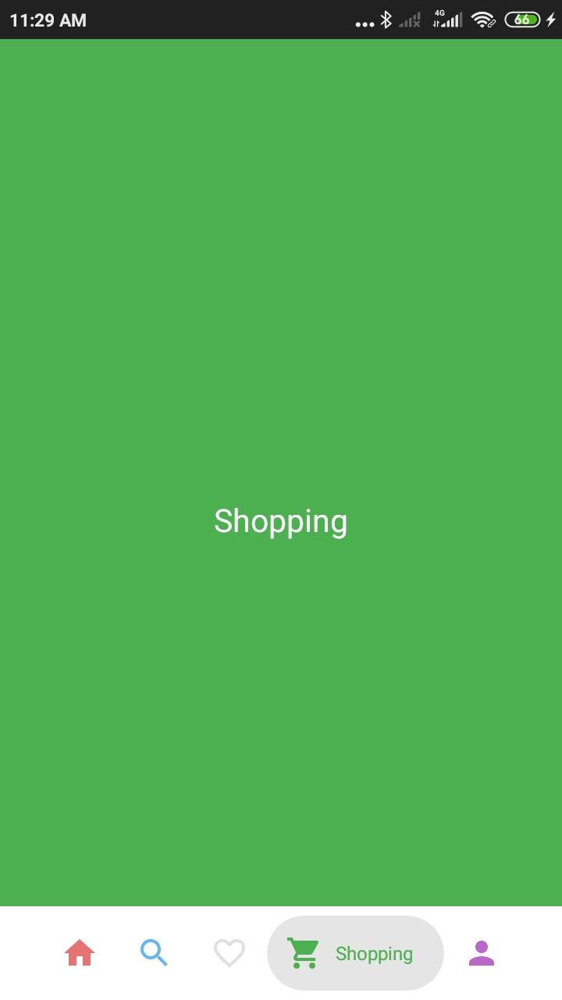

# Tutorial-Android

## Bubble Bottom Navigation
<table style="width:100%">
  <tr>
    <th>1. Demo </th>
    <th>2. Demo</th> 
    <th>3. Demo</th> 
    <th>4. Demo</th> 
    <th>5. Demo</th> 
  </tr>
  <tr>
    <td></td>
    <td></td>
    <td></td>
    <td></td>
    <td></td> 
    
  </tr>
</table>
